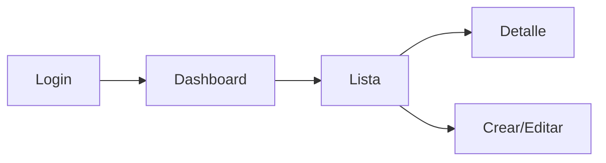

## Plantilla de entrega (copiar/pegar)

### 1) Supuestos y alcance
- **Supuestos**:
  - ...
- **Fuera de alcance (por ahora)**:
  - ...

### 2) Análisis UX
- **Personas / roles**:
  - ...
- **Casos de uso (top 5–10)**:
  - ...
- **User journey (resumen)**:
  - ...
- **Principios de usabilidad aplicados**:
  - ...

### 3) IA + navegación
- **Sitemap**:
  - ...
- **Rutas sugeridas**:
  - `/...`
- **Patrón de navegación**:
  - Sidebar / Tabs / Breadcrumbs (justificación breve)

### 4) Catálogo de vistas
Para cada vista:
- **Nombre**:
- **Objetivo**:
- **Acciones**:
- **Datos**:
- **Estados**: loading / empty / error / success
- **Bloques (Flowbite)**: shell + contenido + feedback

### 5) UI Kit
- **Tokens**:
  - Colores (primary/secondary/success/warning/danger/info/surface/text)
  - Tipografía (escala + pesos)
  - Espaciado (grid 8px)
  - Radios/sombras/bordes/focus ring
- **Componentes** (con variantes):
  - Button, Input, Select, Textarea, Toggle, Tabs, Badge, Alert, Toast, Modal, Dropdown, Card, Table, Pagination, Breadcrumb

### 6) Wireframes (conceptual)
Opción A: ASCII (rápido)

Opción B: Mermaid (flujo)

### 7) Implementación (HTML + Tailwind)
- **Estructura sugerida**:
  - `pages/*.html`
  - `components/*.html`
- **Páginas**:
  - `pages/...html`: layout + secciones
- **Componentes**:
  - `components/...html`: snippet reutilizable

**App Shell recomendado (base)**:
- Usa el template `snippets/dashboard-shell.html` como layout base (topbar + sidebar + main) y reemplaza:
  - Logo / nombre
  - Ítems del sidebar según el sitemap
  - Contenido de `main` por vista (Dashboard, Lista, Detalle, Form, etc.)

### 8) Documentación de componentes
- **Componente**:
  - Props:
  - Estados:
  - Accesibilidad:

### 9) Checklist a11y + responsive
- Labels asociados (for/id)
- Focus visible (ring)
- Targets táctiles >= 44px
- Navegación por teclado
- Contraste AA

