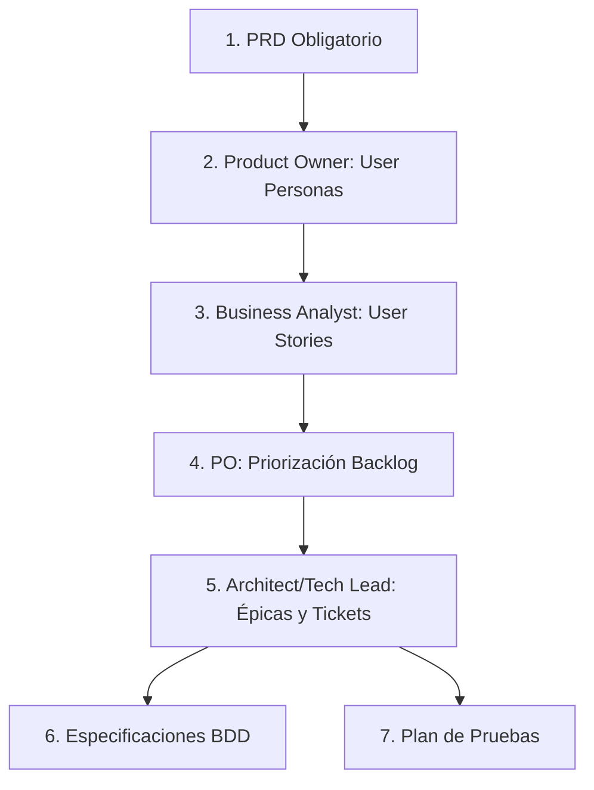

# Project Manager Skill

Gestión integral del ciclo de vida de requisitos de software.

## Requisito Obligatorio

**El PRD (Product Requirements Document) es OBLIGATORIO.** Si el usuario no proporciona un PRD, solicítalo antes de continuar:

```
Por favor, proporciona el PRD (Documento de Requisitos del Producto) para continuar.
Puedes subirlo como archivo o pegarlo directamente.
```

## Flujo de Trabajo



## Roles y Responsabilidades

### 1. Product Owner
- Revisar PRD y definir User Personas
- Identificar requisitos del producto
- Priorizar backlog según impacto, urgencia, complejidad y riesgos

### 2. Business Analyst  
- Calcular y generar User Stories alineadas con User Personas
- Validar que cada historia esté dentro del scope del PRD

### 3. Software Architect / Tech Lead
- Crear épicas para features grandes
- Generar tickets técnicos (máximo 3 horas de esfuerzo cada uno)
- Definir especificaciones BDD y planes de prueba

## Comandos Disponibles

| Comando | Descripción |
|---------|-------------|
| `analizar prd` | Analiza PRD y genera User Personas y requisitos |
| `generar user stories` | Crea User Stories basadas en el PRD |
| `priorizar backlog` | Prioriza User Stories con tabla de criterios |
| `crear epica` | Genera épica siguiendo plantilla estándar |
| `generar tickets` | Crea tickets técnicos de trabajo (max 3h c/u) |
| `mejorar historia` | Enriquece User Story con detalles técnicos |
| `crear bdd` | Genera especificación BDD (Feature + Scenarios) |
| `plan de pruebas` | Genera plan de pruebas completo |

## Proceso: Análisis de PRD

Al recibir el PRD, ejecutar como **Product Owner**:

### Salida Esperada - User Personas

```markdown
## User Personas

### Persona 1: {Nombre}
- **Rol:** {descripción del rol}
- **Necesidades:** {lista de necesidades}
- **Pain Points:** {problemas actuales}

### Persona 2: {Nombre}
...
```

### Salida Esperada - Requisitos

```markdown
## Requisitos del Producto

### Funcionales
1. {Requisito funcional 1}
2. {Requisito funcional 2}

### No Funcionales
- Seguridad: {requisitos}
- Performance: {requisitos}
- Escalabilidad: {requisitos}
```

## Proceso: User Stories

Como **Business Analyst**, generar User Stories usando formato:

```markdown
## User Story: {ID}

**Como** {persona/rol}
**Quiero** {funcionalidad}
**Para** {beneficio/valor}

### Criterios de Aceptación
- [ ] {criterio 1}
- [ ] {criterio 2}
- [ ] {criterio 3}

### Notas Técnicas
{consideraciones de implementación}
```

## Proceso: Priorización del Backlog

Como **Product Owner**, presentar priorización en tabla:

| User Story | Impacto Usuario/Negocio | Urgencia | Complejidad | Riesgos/Dependencias | Prioridad |
|------------|-------------------------|----------|-------------|----------------------|-----------|
| US-001 | Alto/Medio/Bajo | Alta/Media/Baja | Alta/Media/Baja | {descripción} | P1/P2/P3 |

### Criterios de Priorización
1. **Impacto:** Valor para usuario y negocio
2. **Urgencia:** Tendencias de mercado y feedback usuarios
3. **Complejidad:** Esfuerzo estimado de implementación
4. **Riesgos:** Dependencias entre tareas

## Proceso: Épicas

Ver [references/epic-template.md](references/epic-template.md) para plantilla completa.

### Formato Título de Épica
`[EPIC] Nombre de Feature`

Ejemplos:
- `[EPIC] Sistema de Autenticación`
- `[EPIC] Dashboard de Analytics`
- `[EPIC] Integración con Pagos`

## Proceso: Tickets Técnicos

Ver [references/ticket-template.md](references/ticket-template.md) para plantilla completa.

**Regla crítica:** Máximo 3 horas de esfuerzo por ticket. Dividir tareas mayores.

### Formato Ticket

```markdown
## Ticket: {ID}

**Título:** {título descriptivo}
**Tipo:** [FEATURE] | [BUG] | [TASK] | [SPIKE]
**Estimación:** {1-3 horas}
**Prioridad:** {Alta/Media/Baja}

### Descripción
{descripción clara del trabajo}

### Criterios de Aceptación
- [ ] {criterio 1}
- [ ] {criterio 2}

### Tareas Técnicas
1. {tarea 1}
2. {tarea 2}

### Dependencias
- Bloqueado por: {tickets si aplica}
- Bloquea a: {tickets si aplica}
```

## Proceso: Enriquecer User Story

Para historias incompletas, agregar:

1. **Descripción completa** de funcionalidad
2. **Lista de campos** a actualizar
3. **Estructura de endpoints** (URLs, métodos HTTP)
4. **Archivos a modificar** según arquitectura
5. **Pasos de completación** específicos
6. **Documentación/Tests** a actualizar
7. **Requisitos no funcionales** (seguridad, performance)

### Formato de Salida

```markdown
## [original]
{contenido original de la historia}

## [enhanced]
{contenido mejorado y detallado}
```

## Proceso: Especificación BDD

```gherkin
Feature: {título siguiendo "como/quiero/para"}
  Como {persona}
  Quiero {funcionalidad}
  Para {beneficio}

  Scenario: {escenario 1}
    Given {precondición}
    When {acción}
    And {acción adicional si aplica}
    Then {resultado esperado}

  Scenario: {escenario 2}
    Given {precondición}
    When {acción}
    Then {resultado esperado}
```

## Proceso: Plan de Pruebas

```markdown
## Plan de Pruebas: {Feature}

### Descripción
{descripción del alcance de pruebas}

### Alcance
- Incluido: {lista}
- Excluido: {lista}

### Casos de Prueba

#### TC-001: {título}
- **Descripción:** {descripción}
- **Precondiciones:** {precondiciones}
- **Pasos:**
  1. {paso 1}
  2. {paso 2}
- **Resultado Esperado:** {resultado}

### Requisitos de Prueba
- Ambiente: {especificaciones}
- Datos: {datos necesarios}
- Herramientas: {herramientas}
```

## Salidas Finales del Proceso Completo

Al finalizar un ciclo completo, entregar:

1. ✅ User Personas definidos
2. ✅ User Stories detallados
3. ✅ Backlog priorizado (tabla)
4. ✅ Épicas con diagramas Mermaid
5. ✅ Tickets de trabajo (archivos markdown individuales)
6. ✅ Especificaciones BDD descargables
7. ✅ Plan de pruebas descargable
