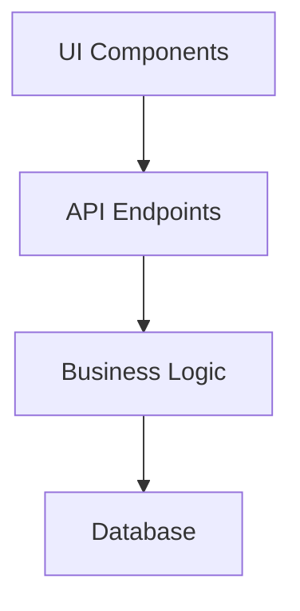
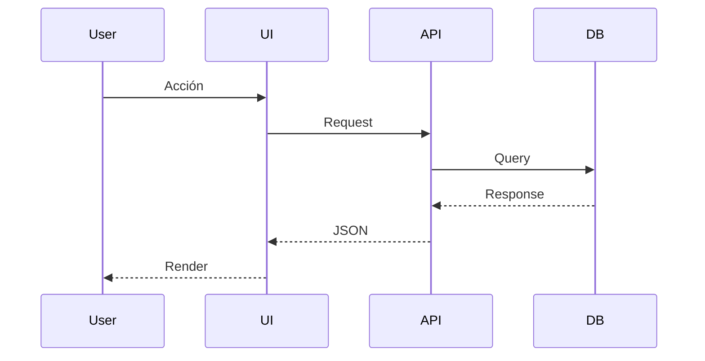
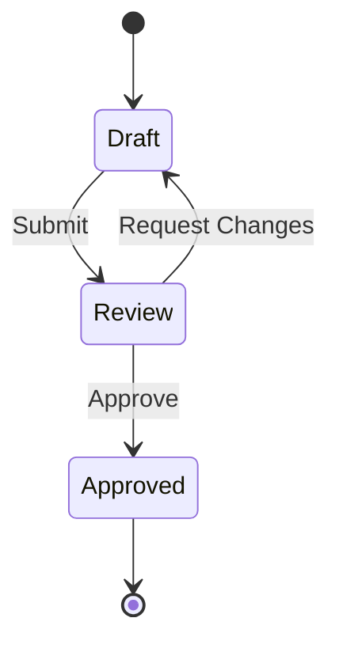
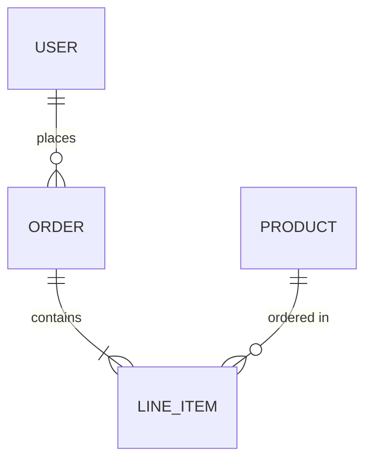

# Plantilla de Épica

Usar esta plantilla para crear épicas de features grandes que requieren múltiples tareas.

## Estructura Completa

```markdown
# [EPIC] {Título de la Épica}

**Figma:** {link de figma si está disponible}

## Feature Overview

{2-3 párrafos describiendo:
- Qué hace esta funcionalidad
- Quién la usa
- Por qué es necesaria}

## Requirements

### {Sección 1: Área Funcional Principal}

#### {Subsección}
- Requisito 1
- Requisito 2
- Requisito 3

#### {Otra Subsección}
- Requisito 1
- Requisito 2

### {Sección 2: Otra Área Principal}

#### {Subsección}
- Requisito 1
- Requisito 2

## Technical Considerations

### Performance
- {Requisito de rendimiento 1}
- {Requisito de rendimiento 2}

### Data Integration
- {Fuente de datos}
- {Puntos de integración}

### UI Components
- {Componente 1}
- {Componente 2}

## Implementation Checklist

- [ ] {Entregable principal 1}
- [ ] {Entregable principal 2}
- [ ] {Entregable principal 3}

## Diagrams

{Diagramas Mermaid según necesidad}
```

## Convenciones de Nombres

| Tipo | Formato | Ejemplo |
|------|---------|---------|
| Épica | `[EPIC] Nombre Feature` | `[EPIC] Sistema de Notificaciones` |
| Feature | `[FEATURE] Descripción (Componente)` | `[FEATURE] Filtros de búsqueda (UI)` |
| Task | `[TASK] Descripción técnica` | `[TASK] Migración de base de datos` |

## Diagramas Mermaid Recomendados

### Arquitectura



### Flujo de Datos



### Estados



### Entidades



## División de Épica en Tasks

Después de crear la épica, generar tasks individuales:

### Patrón de Naming
De `[EPIC] Sistema de Autenticación`:
- `[FEATURE] Login con email/password (API)`
- `[FEATURE] Login con email/password (UI)`
- `[FEATURE] Registro de usuarios (API)`
- `[FEATURE] Registro de usuarios (UI)`
- `[FEATURE] Recuperación de contraseña (API + UI)`
- `[TASK] Configuración de JWT`
- `[TASK] Tests de integración auth`

### Tabla de Tasks Sugeridas

Al final de cada épica incluir:

```markdown
## Suggested Tasks

| # | Título | Componente | Bloqueado Por | Estimación |
|---|--------|------------|---------------|------------|
| 1 | [FEATURE] Task name | API | - | 3h |
| 2 | [FEATURE] Task name | UI | Task 1 | 2h |
| 3 | [TASK] Task name | Backend | Task 1 | 1h |
```
